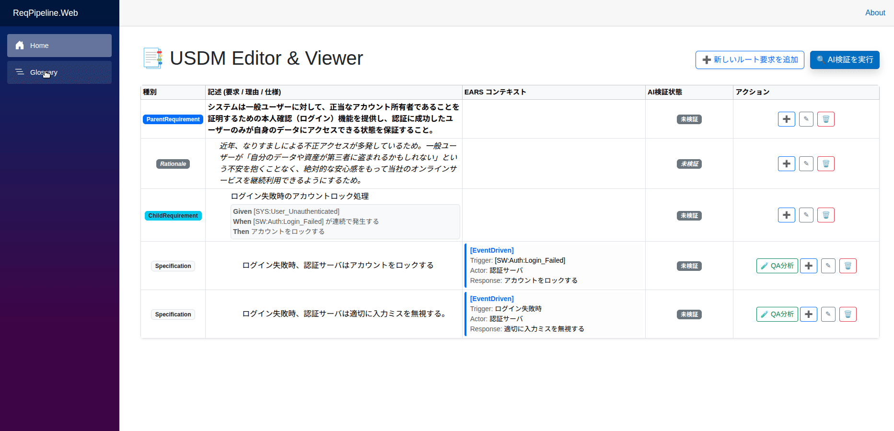

# ReqPipeline (USDM AI-Reviewer)

[](https://dotnet.microsoft.com/)
[](https://ollama.ai/)
[](https://opensource.org/licenses/MIT)

[🇺🇸 Read this in English](README.md)
[🇯🇵 Read this in Japanese](README_ja.md)


**ReqPipeline** は、要求仕様の記述手法である **USDM** と **ローカルLLM** を融合させた、次世代の要求仕様エディタ＆静的解析パイプラインです。
人が見落としがちな仕様の矛盾をAIが意味論的に検証し、開発の超上流工程でバグを検知します。



## 「誰もが正しく、正しいものを作れるようにする」

多くの開発現場では、要求定義の段階で「曖昧さ」が残されたまま実装が進み、後からコンテキストの不一致が発覚するという悲劇が起きています。ReqPipelineは、USDM/EARS/BDDという強力なフレームワークと、論理的矛盾を即座に見抜くAIレビューを組み合わせることで、開発の最上流工程で「認識のズレ」というバグを根絶することを目指しています。

##  なぜ ReqPipeline を作ったのか？

ソフトウェア開発において、**「要求定義フェーズ」は最もバグが混入しやすく、同時に「バグの除去コストが最も安い」フェーズ**です。
実装やテスト段階で仕様の矛盾が発覚した場合、その手戻りコストは要求定義段階の10倍〜100倍に膨れ上がります。

しかし、従来の自然言語による要求定義では、以下のような「人間由来のバグ」を防ぐことは困難でした。
* **コンテキストの不一致**: 書き手と開発者の間にある「暗黙の了解」による認識ズレ。
* **思考の曖昧さ・考慮漏れ**: 異常系の仕様抜けや、エッジケースの未定義。
* **論理的矛盾**: システム全体で見たときの、仕様同士のサイレントな競合。

**ReqPipeline は、この「仕様のバグ」をコードを書く前に（Shift-Leftで）駆逐するためのツールです。**

人間が陥りやすい曖昧さを **USDM / EARS / BDD** という厳格な「型」によって物理的に防ぎ、さらにローカルLLMを用いた **AIパイプライン** が、人間では見落としがちな論理的矛盾を24時間・一瞬で検知します。
要求定義の段階でバグを取り除くことで、チーム全員が「正しく、正しいものを作る」ことに集中できる世界を実現します。

##  はじめに (Getting Started)

ReqPipeline はクロスプラットフォーム（Windows, macOS, Linux）で動作します。
ローカル環境でAIパイプラインを動かすためのセットアップ手順は以下の通りです。

### 1. 前提条件 (Prerequisites)
実行環境に以下がインストールされていることを確認してください。
* **[.NET 10.0 SDK](https://dotnet.microsoft.com/download/dotnet/10.0)**
* **[Ollama](https://ollama.ai/)** (ローカルLLM実行エンジン)

### 2. LLMモデルの準備
本システムはデフォルトで `qwen2.5:7b` モデルを使用します。ターミナル（コマンドプロンプト）で以下のコマンドを実行し、モデルをダウンロードしてください。
*(※初回のみ数GBのダウンロードが発生します)*

```bash
ollama run qwen2.5:7b
```
Note: Ollamaがバックグラウンドで起動している状態にしておいてください。

### 3. インストールと起動 (Installation & Run)
リポジトリをクローンし、Webプロジェクトを実行します。

```bash
# リポジトリのクローン
git clone https://github.com/boxdate/ReqPipeline.git
cd ReqPipeline
```

```bash
# Webアプリの起動
cd src/ReqPipeline.Web
dotnet run
```

### 4. ブラウザでアクセス
起動後、ターミナルに表示されるURL（例: http://localhost:5000 または https://localhost:5001）にブラウザでアクセスしてください。

##  基本的な使い方 (Basic Usage)
サンプルデータの読み込み
プロジェクト直下（実行ディレクトリ）にある requirements.json（要求仕様ツリー）と glossary.json（用語集）が自動的に読み込まれます。

### 要求・理由・仕様の編集
Web UI上で、USDMのフォーマットに従い「要求（Requirement）」「理由（Rationale）」「仕様（Specification）」を追加・編集します。仕様には EARS コンテキストを設定できます。

### AI検証の実行
画面右上の 「AI検証を実行」 ボタンをクリックします。
バックグラウンドでOrchestratorが動き出し、ローカルLLMが仕様の矛盾や論理的欠陥を分析します。

### 結果の確認
矛盾が発見された場合、該当するノードの直下に 「矛盾」 のバッジとAIからの具体的な指摘事項（理由）が表示されます。指摘に従って仕様を修正し、再度検証を回してください。

### LLMモデルのカスタマイズ (Customizing the LLM)

本システムは、標準的なPCでも動作するようにデフォルトで軽量な `qwen2.5:7b` を使用していますが、VRAMに余裕がある環境であれば、よりパラメータ数の多いモデル（例: `qwen2.5:14b` や `qwen3.5:9b` など）に変更することで、AIレビューの論理推論精度をさらに向上させることができます。

モデルの変更は、以下の2つの方法のいずれかで行えます。

#### 方法1: `appsettings.json` を編集する
`src/ReqPipeline.Web/appsettings.json` ファイルを開き、以下のセクションを追加・編集してください。
```json
{
  "OllamaSettings": {
    "ModelName": "qwen2.5:14b"
  }
}
```

#### 方法2: 環境変数を使用する (CI/CDや一時的な切り替えに便利)
環境変数 OllamaSettings__ModelName（アンダースコア2つ）を指定して実行することも可能です。

(macOS / Linux の場合)

```bash
export OllamaSettings__ModelName="qwen2.5:14b"
dotnet run
```

(Windows PowerShell の場合)

```PowerShell
$env:OllamaSettings__ModelName="qwen2.5:14b"
dotnet run
```

## コントリビューション (Contributing)

ReqPipeline は、「誰もが正しい仕様を書ける世界」を目指すオープンソースプロジェクトです。
コードの記述だけでなく、様々な形でのコントリビューションを大歓迎しています！

### 歓迎する貢献の形
以下のような貢献をお待ちしています。どんな小さなことでも構いません！

### 歓迎する貢献の形
以下のような貢献をお待ちしています。コードが書けなくても、あなたの「専門知識」が最大の貢献になります！

* **要求工学の知見を活かしたプロンプト改善 (Prompt Engineering with RE Expertise)**
  * 本ツールの心臓部である `SemanticValidator.cs` などのLLMプロンプトの改善提案。
  * 「USDMの作法として正しいか」「EARSの構文として論理的か」「エッジケースの考慮漏れはないか」といった、**要求工学（Requirements Engineering）の専門知識**をプロンプトに落とし込み、AIを「熟練の要求アナリスト」に育て上げるPRを熱望しています！要求開発の専門家やQAエンジニアの方々の知見が、そのままツールの賢さに直結します。
* **バグ報告・ユースケースの提案 (Issues)**
  * 「実際の現場の仕様書を食わせたら、AIがこんな見落としをした」「UIのここが使いにくい」といった報告や、新しい機能のアイデア。
* **検証用サンプルデータの提供**
  * テスト用に使える、現場の「あるある」な矛盾や曖昧さを含ませた `requirements.json` のサンプルケース。
* **コードのコントリビューション (Pull Requests)**
  * バグ修正、Blazor UIの改善、C#のアーキテクチャリファクタリングなど。

### 現在、特に助けを求めている領域 (Help Wanted!)
私たちは将来的に、このツールを「チーム全体でコラボレーションできるインフラ」へと進化させたいと考えています。以下の領域に興味がある・得意なエンジニアを大募集しています！

1. **JSONファイルを活用したチーム開発のベストプラクティス化**
   * ローカルのJSONファイルをGitを用いて、複数人のチームで要求・仕様を開発するベストプラクティスの開発・実践など。
2. **Phase 2に向けたDB設計・マルチユーザー対応**
   * 現在はローカルのJSONファイルベースですが、PostgreSQL等を用いたチーム開発用のバックエンド設計の議論・実装。
2. **UI/UXの改善 (Blazor)**
   * USDMのツリー構造をより直感的にドラッグ＆ドロップで編集できるUIの実装など。
3. **英語ドキュメントの翻訳**
   * 世界中の要求開発者に届けるための、多言語対応。

### 開発の始め方
1. このリポジトリを Fork します。
2. 新しいブランチを作成します (`git checkout -b feature/amazing-feature`)。
3. 変更をコミットします (`git commit -m 'Add some amazing feature'`)。
4. ブランチに Push します (`git push origin feature/amazing-feature`)。
5. Pull Request を作成してください！

## 動作環境について (Tested Environments)

本システムは `.NET 10` および `Ollama` を基盤としているため、設計上は Windows / macOS / Linux のクロスプラットフォームで動作します。

ただし現在、作者のローカル環境（Ubuntu / Linux）でのみ動作確認が完了している状態です。
**Windows や Mac 環境（特に Apple Silicon 搭載機）で動かしてみた方のフィードバックや、動作報告の Issue を大歓迎しています！**
「Macでも動いたよ！」「Windowsだとここのパス設定でエラーが出た」など、どんな些細な情報でもプロジェクトの大きな助けになります。